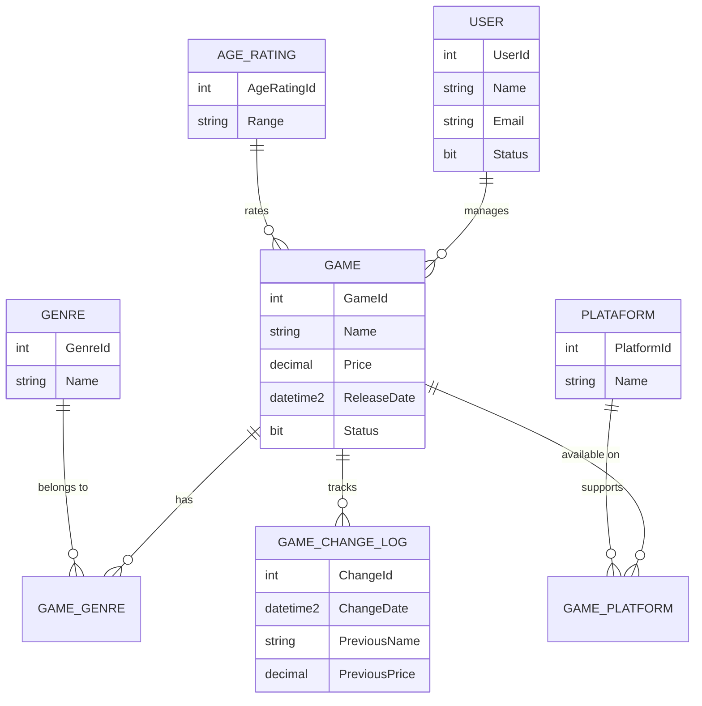

# 👑 Royal Games


A high-performance, secure backend API for managing a game database, currently under active development. This project serves as a practical implementation of modern backend architecture, featuring relational database design, secure authentication, and a scalable RESTful API.

---

## 🛠 Tech Stack

### Backend
- **Language/Framework:** ASP.NET Core 8.0
- **Database:** SQL Server
- **Architecture:** Layered Architecture (Controllers, Services, Data)
- **Security:** RESTful API with Role-Based Access Control (RBAC)

### Frontend (Upcoming)
- **Framework:** Next.js

### Infrastructure
- **Deployment Platform:** Microsoft Azure

---
## 📍 Project Roadmap

- [x] **Backend API:** Fully implemented CRUD for Users, Genres, Platforms, Games, and Classifications with Authorization.
- [ ] **Frontend Integration:** Developing the Next.js dashboard to interface with the REST endpoints.
- [ ] **Cloud Deployment:** Deploying the full-stack application to Microsoft Azure.

---

## 🗄️ Database Design

The following diagram illustrates the relational structure of the database, highlighting the core entities and their associations:


---

## 🔐 API Features

The API is designed for security and scalability, providing a full CRUD suite for the following entities, all protected by **Authorize** policies:

- **Users:** Manage system access and profiles.
- **Genres:** Categorize games by genre.
- **Platforms:** Track game availability across hardware.
- **Games:** Manage core game library entities.
- **Classifications:** Handle parental/age rating data.

### Interactive Documentation

Once the API is running locally, you can access the **Swagger UI** to test the endpoints:
* **HTTPS (Recommended):** [https://localhost:7255/swagger](https://localhost:7255/swagger)
* **HTTP:** [http://localhost:5232/swagger](http://localhost:5232/swagger)


---

## 🚀 How to Run

### Prerequisites

- .NET 8.0 SDK or higher installed.
- SQL Server instance (LocalDB or Docker container).

### Setup Instructions

1. **Clone the repository:**
   ```bash
   git clone https://github.com/guirrs/Royal-Games.git
   cd Royal-Games
   ```

2. **Configure the database:**
   - Update your connection string in `appsettings.json` to point to your local SQL Server instance.

3. **Apply database migrations:**
   ```bash
   cd RoyalGames.Api
   dotnet ef database update
   ```

4. **Run the API:**
   ```bash
   dotnet run
   ```
